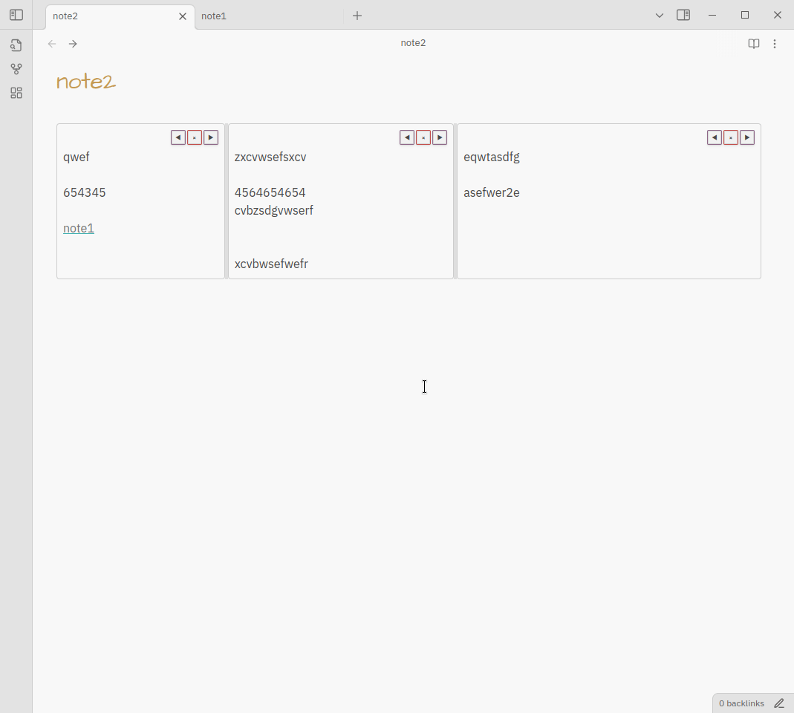

# Obsidian Multi-column

A Obsidian plugin that adds multi-column layout support for note content. It provides a Markdown post-processor and a column editor so you can split content into responsive columns.

## Installation

- Install BRAT plugin https://github.com/TfTHacker/obsidian42-brat in obsidian
- In obsidian BRAT plugin setting, select Add beta plugin
- Enter repo URL https://github.com/noctildon/obsidian-multi-column
- Select latest version
- Click Add plugin button

## Usage
- Use the command palette (CMD/CTRL+P) and search for the plugin commands `Insert Multi-Column Block` to initialize a multi-column block

## Features

- Create and edit column content

- Resize columns width

- Add/Remove columns

- Reorder columns by drag & drop

- Wikilink and internal link

- Embedded note/image
